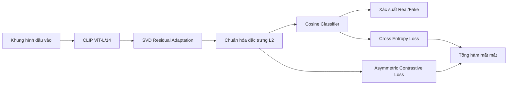

# QHTD-CLIP: Phát Hiện Giả Mạo Khuôn Mặt Dựa Trên CLIP

Đây là kho mã nguồn phục vụ **tiểu luận cuối kỳ** môn **Toán cho Trí tuệ Nhân tạo** (HK2 năm học 2025-2026), tập trung vào một mô hình duy nhất: **effort_asy**.

Phiên bản hiện tại đã được tinh gọn theo định hướng học thuật và tái lập thực nghiệm, chỉ giữ lại các thành phần cần thiết cho huấn luyện và đánh giá mô hình.

## Mục Lục

- [1. Giới Thiệu](#1-giới-thiệu)
- [2. Mục Tiêu Và Phạm Vi](#2-mục-tiêu-và-phạm-vi)
- [3. Thông Tin Nhóm](#3-thông-tin-nhóm)
- [4. Cơ Sở Phương Pháp](#4-cơ-sở-phương-pháp)
- [5. Thiết Lập Dữ Liệu Và Cấu Hình](#5-thiết-lập-dữ-liệu-và-cấu-hình)
- [6. Cấu Trúc Kho Mã Nguồn](#6-cấu-trúc-kho-mã-nguồn)
- [7. Cài Đặt Môi Trường](#7-cài-đặt-môi-trường)
- [8. Quy Trình Huấn Luyện Và Đánh Giá](#8-quy-trình-huấn-luyện-và-đánh-giá)
- [9. Kết Quả Tham Khảo](#9-kết-quả-tham-khảo)
- [10. Khả Năng Tái Lập](#10-khả-năng-tái-lập)
- [11. Trích Dẫn](#11-trích-dẫn)

## 1. Giới Thiệu

Bài toán phát hiện giả mạo khuôn mặt đòi hỏi mô hình có khả năng tổng quát tốt giữa các miền dữ liệu khác nhau. Trong khuôn khổ đề tài, nhóm triển khai mô hình effort_asy dựa trên CLIP ViT-L/14 kết hợp cơ chế tinh chỉnh tham số hiệu quả nhằm tăng độ ổn định khi đánh giá liên miền.

## 2. Mục Tiêu Và Phạm Vi

### 2.1. Mục tiêu

- Xây dựng pipeline huấn luyện/đánh giá gọn, rõ ràng cho effort_asy.
- Duy trì kết quả định lượng ổn định trên các bộ kiểm thử mục tiêu.
- Đảm bảo khả năng tái lập bằng cấu hình và mã nguồn nhất quán.

### 2.2. Phạm vi

- Chỉ sử dụng mô hình effort_asy.
- Loại bỏ các detector và thành phần benchmark không liên quan.
- Tập trung vào dữ liệu đã được tiền xử lý sẵn.

## 3. Thông Tin Nhóm

| Hạng mục | Nội dung |
| --- | --- |
| Trường | Đại học Sư phạm Kỹ thuật TP.HCM (HCMUTE) |
| Học phần | Toán cho Trí tuệ Nhân tạo |
| Học kỳ | HK2 năm học 2025-2026 |
| Sinh viên 1 | Nguyễn Đức Thịnh |
| Sinh viên 2 | Phùng Lê Thành Quân |

## 4. Cơ Sở Phương Pháp

### 4.1. Thành phần mô hình

- Backbone: CLIP ViT-L/14 (`openai/clip-vit-large-patch14`).
- Cơ chế thích nghi: SVD residual adaptation trên các lớp self-attention.
- Bộ phân loại: cosine classifier.
- Hàm mục tiêu: Cross Entropy kết hợp Asymmetric Contrastive Loss.

### 4.2. Hàm mất mát tổng

$$
\mathcal{L} = \mathcal{L}_{CE} + \lambda\mathcal{L}_{asym}
$$

### 4.3. Luồng xử lý tổng quát



## 5. Thiết Lập Dữ Liệu Và Cấu Hình

Kho mã nguồn giả định dữ liệu đã được tiền xử lý:

- Thư mục ảnh: `DeepfakeBench/datasets/rgb`
- Thư mục metadata JSON: `DeepfakeBench/preprocessing/dataset_json`

Các tệp cấu hình chính:

- `DeepfakeBench/training/config/detector/effort_asy.yaml`
- `DeepfakeBench/training/config/train_config.yaml`
- `DeepfakeBench/training/config/test_config.yaml`

## 6. Cấu Trúc Kho Mã Nguồn

```text
QHTD-CLIP/
|- README.md
|- conda.txt
|- ckpt_best.pth
|- Nhom01_TLCK.pdf
`- DeepfakeBench/
   |- train.sh
   |- test.sh
   |- training/
   |  |- train.py
   |  |- test.py
   |  |- detectors/effort_asy.py
   |  |- dataset/
   |  |- config/
   |  `- trainer/
   `- preprocessing/dataset_json/
```

## 7. Cài Đặt Môi Trường

Tham khảo hướng dẫn đầy đủ trong `conda.txt`.

Cài đặt nhanh:

```bash
cd DeepfakeBench
bash install.sh
```

## 8. Quy Trình Huấn Luyện Và Đánh Giá

### 8.1. Huấn luyện

```bash
cd DeepfakeBench
python training/train.py \
  --detector_path ./training/config/detector/effort_asy.yaml \
  --train_dataset "FaceForensics++" \
  --test_dataset "Celeb-DF-v2" "FaceShifter" "DeeperForensics-1.0"
```

### 8.2. Đánh giá với checkpoint có sẵn

```bash
cd DeepfakeBench
python training/test.py \
  --detector_path ./training/config/detector/effort_asy.yaml \
  --test_dataset "Celeb-DF-v2" "FaceShifter" "DeeperForensics-1.0" \
  --weights_path ../ckpt_best.pth
```

## 9. Kết Quả Tham Khảo

- AUC trung bình liên miền (cross-dataset): **0.9392**
- AUC trung bình nội miền (FF++): **99.05**
- Số tham số được huấn luyện: **0.19M**

## 10. Khả Năng Tái Lập

- Cập nhật đúng đường dẫn dữ liệu trong `train_config.yaml` và `test_config.yaml`.
- Lần chạy đầu tiên cần tải trọng số CLIP từ HuggingFace.
- Nếu môi trường ngoại tuyến, cần chuẩn bị cache mô hình trước.

## 11. Trích Dẫn

```bibtex
@article{nguyenphung2026qhtd,
  title={Ứng dụng SVD bảo toàn không gian đặc trưng khi tái huấn luyện mô hình cho bài toán phân loại ảnh giả khuôn mặt},
  author={Nguyễn Đức Thịnh and Phùng Lê Thành Quân},
  journal={Tiểu luận kết thúc học phần Toán cho Trí tuệ Nhân tạo - HCMUTE},
  year={2026}
}
```